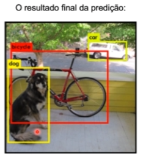

## Detecção de objetos com Yolo, Darknet, OpenCV e Python

**Yolo (Somente olha uma vez):**
- Arquitetura de redes neurais utilizado para trabalhar com detecção de objetos.
- É um método de detecção de objetos de passada única que utiliza uma rede neural convolucional como extrator de características (features).
- Diferente de outros algoritmos de detecçãode objetos (como R-CNN ou Faster R-CNN), ele apenas precisa olhar pela imagem uma única vez para enviar para a rede neural.
- Utiliza uma rede neural única usando as características da imagem inteira para detectar múltiplas caixas, cada uma contendo um objeto.
- Dimensões pré-definidas (âncoras) a de objetos anotados no conjunto de treinamento.
- - Por exemplo, as dimensões de um carro são diferentes para as dimensões de uma pessoa, portanto, as dimensões das caixas delimitadoras serão pré-definidas.

**Darknet:**
- YOLO utiliza uma rede neural profunda, cuja arquitetura é chamada de Darknet (que é o mesmo nome do framework utilizado para implementar).
- Darknet é um framework open source para redes neurais (assim como, PyTorch ou Tensorflow).
- É um framework para trabalhar com Deep Learning (Bilioteca em C).
- Suporta CPU e GPU.

**OpenCV:**
- Biblioteca mais clássica para se trabalhar com visão computacional.

**Objetivos do YOLO:**
- Treina classificadores multi-classe para identificar duas (ou mais) classes.
- Retorna a caixa delimitadora (bounding boxes) para selecionarmos onde exatamente este objeto está na imagem.
- **Objetivo principal:** Dada uma imagem, identifica a localização de um objeto e realiza a previsão da classe.

### Como funciona?

O algoritmo divide a imagem em um grid de S x S células.

No imagem acima, é dividido em uma grade de 13x13 (nas versões mais recentes tem se usado o tamanho 19x19).

Em cada uma dessas células é responsável por fazer a predição de 5 caixas delimitadoras, para caso haja mais de um objeto naquela célula

Retorna uma **pontuação de confiança**: o quanto de certeza o algoritmo tem que aquela caixa delimitadora contém algum tipo de objeto (**aqui ele não classifica o objeto**, mas somente identifica o local com a **possível presença de um objeto**).

Para cada caixa, a célula também faz a previsão de uma classe, fornecido um valor de probabilidade para cada uma das classes possíveis.

O valor de confiança para a caixa delimitadora e a predição da classe são bombinados em uma pontuação final.

- Com uma grade 13x13 há 169 células com 5 caixas delimitadoras, o que resulta em 845 no total.
- A maioria dessas caixas terá um valor de confiança extremamente baixo. Por isso, geralmente são consideradas apenas as caixas cuja pontuação final seja 30% ou mais (threshold, limiar).

Cada caixa delimitadora pode ser descrita a partir de 4 descritores:
- centro da caixa delimitadora (**bxby**).
- largura (**bw**).
- altura (**by**).
- valor **c**, que é a classe correspondente ao objeto (pessoa, carro, etc).
- valor **p** (pc), indica a probabilidade de existir um objeto naquela caixa delimitadora.

Em um grid de 19x19, serão geradas 1805 caixas delimitadoras.

19 x 19 = 361
361 * 5 = 1805

É multiplicado por 5 pois, cada célula irá conter 5 caixas delimitadoras.

#### Supressão não-máxima (Non-Max Supression)
- maioria dessas células não vai conter um objeto, portanto, é necessário obter o valor **pC** que servirá para remover caixas com baixa probabilidade de conter um objeto e também caixas que possuem uma área compartilhada.

#### Âncoras (anchor boxes)
- São retângulos de proporções pré-definidas usados para ter maior correspondência entre as caixas delimitadoras previstas e esperadas.
- Possuem tamanhos iniciais (largura, altura) próximos aos tamanhos dos objetos - serão redimensionados para o tamanho do objeto usando algumas saídas da rede neural.
- A rede neural não deve prever o tamanho final do objeto, mas apenas ajustar o tamanho da âncora (tamanho da caixa delimitadora) mais próxima ao tamanho do objeto.

Por exemplo, uma caixa de âncora para crianças (que será menor) e uma outra para adultos (que consequentemente será maior).

### Retorno do YOLO:

Para descrever a caixa delimitadora são necessários **4 variáveis** (5 se for considerar o nome da classe):
- *coordenada x* de início (left X)
- *coordenada y* de início (top Y)
- *largura* da caixa (width)
- *altura* da caixa (height)

