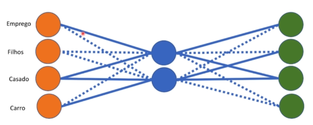

### O que são Encoders?

Basicamente um autoencoder tem uma camada de entrada, camada oculta e uma camada de saída, parecida com a arquitetura das redes neurais artificiais. Um autoencoder serve principalmente para reduzir a dimensionalidade de dados, ou seja, compactar imagens. Por exemplo, temos 50 entradas e queremos diminuir para 20. Porém, também é possível fazer o processo contrário caso seja necessário mais atributos na base de dados.

Um autoencoder tem o **mesmo número de entradas e saídas**, pois precisa codificar dados e depois decodificar para o valor original, então por exemplo, se um autoencoder tem 4 entradas terá 4 saídas.

Um autoencoder é um tipo especial de rede neural que tem a seguinte missão:
- Entrar com os dados (por exemplo: uma imagem).
- Codificar (comprimir) esses dados em uma representação.
- Reconstruir od dados originais (ou algo muito parecido) a partir dessa representação.

#### **Como funciona?**
O autoencoder é dividido em duas partes principais:
- **Encoder (Codificador)**: Pega os dados originais (como uma imagem de 28x28 pixels, por exemplo) e os **comprime** em uma representação mais compacta. Isso é como transformar uma foto grande em uma versão bem pequena (mas sem perder informações importantes).
- **Decoder (Decodificador)**: Tenta **reconstruir** os dados originais a partir da versão compacta. É como pegar aquela foto pequena e aumentá-la de novo para que fique parecida com a original.

#### **Para que serve?**
- Compressão de dados / **Redução de dimensionalidade**: O auto encoder pode aprender a "resumir" grandes imagens em algo menor (compactar) e depois reconstruí-las
- Geração de dados: Usado para criar novas amostras parecidas com as que foram treinadas.
- Remoção de ruído: É possível ensinar o autoencoder a pegar imagens cheias de ruído (como uma foto borrada) e reconstruir uma versão mais limpa.