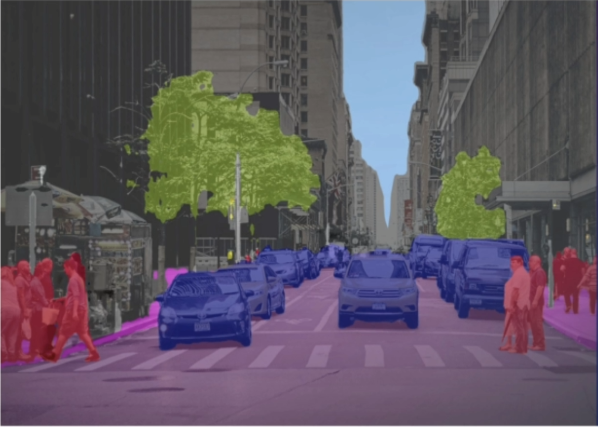
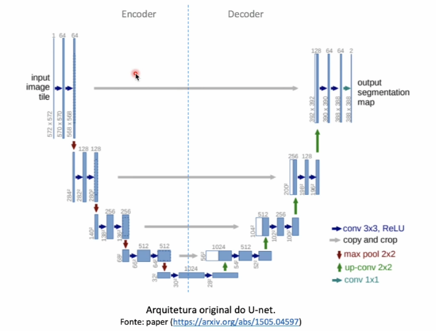

## Segmentação Semântica

A segmentação semântica é uma tarefa de visão computacional usada para dividir uma imagem em diferentes partes ou regiões, atribuindo um rótulo (ou categoria) **para cada pixel da imagem**. Ela analisa cada pixel de uma imagem para identificar **o que ele representa** e classifica esses pixels em diferentes categorias pré-definidas.

Por exemplo: Imagine ma foto de uma rua com um carro, árvores e pessoas. O objetivo da segmentação semântica é:
- Pintar todos os pixels dos carros de uma cor específica.
- Pintar todos os pixels das pessoas de outra cor.
- Pintar o céu de outra cor.
- Pintar as árvores de outra cor.

O resultado final é uma imagem segmentada, onde cada área representa claramente uma categoria. É como se a imagem original fosse "traduzida" em áreas com significados.

### U-NET

A U-NET é uma **arquitetura de rede neural profunda** (não é uma biblioteca) projetada para tarefas de segmentação de imagens.

A arquitetura da U-Net recebe esse nome por seu formato de "U". Ela foi originalmente criada para ser utilizada em segmentação de imagens **biomédicas**.

Existem 2 partes principais nessa arquitetura:
- **Encoder**
    - Recebe a imagem original como parâmetro.
    - São aplicadas camadas convolucionais e de MaxPolling.
        - **2 camadas convolucionais** com **64 filtros** (na primeira camada) de **3x3 pixels** com função de ativação **ReLU**.
            - A cada camada, a quantidade de filtros dobra (64, 128, 256 e 512 filtros).
            - Esses filtros também são chamados de **kernels**.
        - É **reduzido a dimensionalidade** por meio do **MaxPolling** em blocos de **2x2 pixels**.
        - O resultado da aplicação de cada camada é enviada para a próxima camada e assim por diante.
    - No final, na parte central do U temos a imagem compactada (codificada).
- **Decoder**
    - Ocorre o processo inverso do Encoder.
    - A cada camada do decoder é aumentada novamente as dimensões até a resolução da imagem original.
        - Enquanto o MaxPolling reduz as dimensões, o **Up-Conv** aumenta as dimensões em blocos de 2x2 pixels.
        - Os filtros iniciam com 512, 256, 128 e 64 (camada final).
    - Como resultado, temos o **mapa de segmentação**.
        - No final, temos a camada de convolução com as dimensões 1x1 (1 por 1, resolução original).

No caso específico de segmentação de imagens, a versão compactada da imagem (vetor de pixels na parte central do U) é utilizada para representar os recursos da imagem em vários níveis diferentes, enquanto o objetivo do processo de decodificação é projetar semanticamente as características discriminativas aprendidas na imagem pelo decodificador.

**Seria como o decodificador validasse o que o codificador aprendeu.**

*MaxPolling: reduz a dimensionalidade da imagem*.