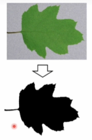
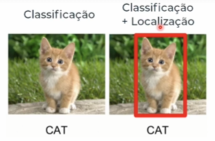
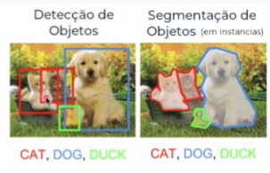
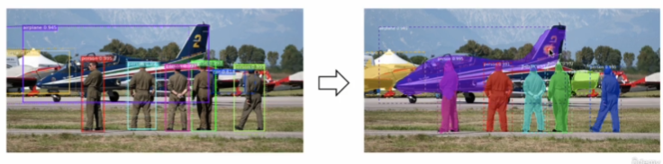
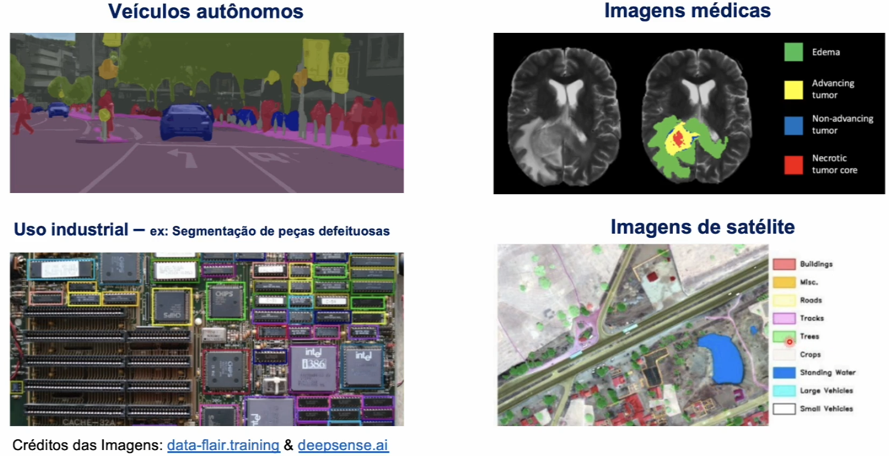
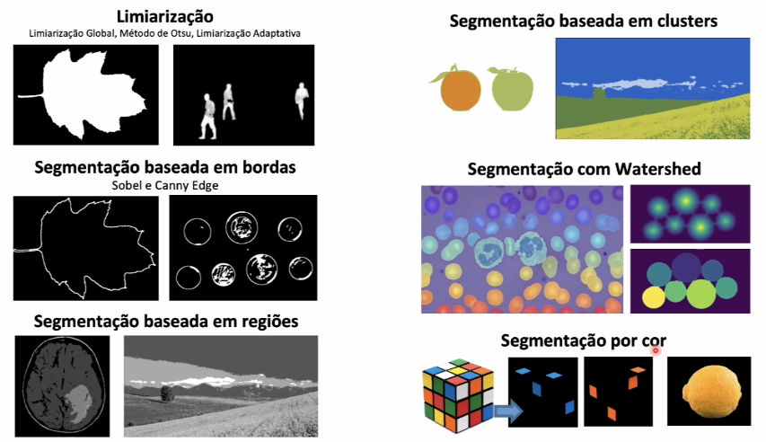
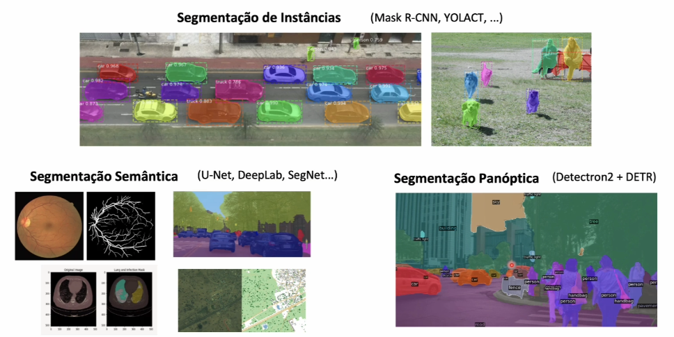
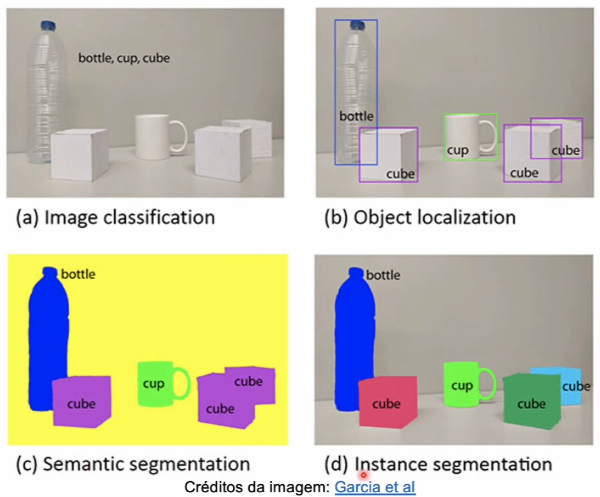

# Segmentação de Imagens

### **O que é Segmentação de Imagens?**

Significa dividir a imagem em uma mistura de regiões, onde cada uma dessas regiões será homogênea, por exemplo, um pedaço que representa a mesma coisa na imagem, como a textura, a cor ou a intensidade.

Por exemplo a imagem abaixo:

Podemos observar que uma das partes homogêneas é a própria folha que está na cor verde e a outra parte homogênea é o fundo da imagem na cor cinza. Quando aplicarmos um algorítmo de segmentação a ideia é separarmos a imagem, onde o objetivo é extrair somente a folha sem considerar o fundo.

Porém, a técnica de segmentação não busca compreender de fato o que está ali ou o que é o objeto, por exemplo, nós só estamos segmentando a imagem, extraindo a folha, mas não é o objetivo desta técnica indicar que esse pedaço da imagem que foi segmentado é uma folha. Isso já é tarefa de outras técnicas de visão computacional, como por exemplo, a detecção de objetos.

Em resumo, a segmentação visa **somente** extrair as partes homogêneas da imagem, porém, não identifica o que é a imagem, pois isto faz parte de outros algorítmos.

**Classificação + Localização**

Temos um outro exemplo, neste caso temos a classificação. Onde o objetivo é indicar qual é o objeto (ou no caso, qual é o animal) detectado. Onde abaixo, fizemos a detecção de um gato e em seguida a localização do mesmo na imagem.

**Detecção de objetos / Segmentação de objetos (em instancias)**

A detecção de objetos irá identificar os objetos na imagem e localiza-los em **formatos de caixa**.

A segmentação de objetos irá detectar os objetos na imagem e localiza-los exatamente na **área em que o objeto está**. Em outras palavras, o algorítmo irá contornar o objeto.

Também podemos utilizar como complemento outras técnicas de aprendizagem profunda para identificar o que é cada um desses objetos (o que é gato, pato ou um cachorro, no caso da imagem abaixo).

### **Diferença entre detecção e segmentação de objetos**

Utilizando como exemplo a imagem abaixo, o objetivo da **detecção de objetos** (imagem esquerda) é criar localizações em formatos de **caixas** nas pessoas e aviões.

O objetivo da **segmentação** (imagem direita) é extrair **exatamente as áreas dos objetos**, por exemplo, segmentar a área específica do avião e das pessoas.

Com isso, a segmentação de imagens pode ser considerada também uma extensão do conceito de detecção de objetos, no qual o objetivo não é apenas descrever a sua classe (se é uma pessoa ou um avião), mas também descrever a sua forma, que é justamente essa seleção.

### **Aplicações**

## **Abordagens para trabalhar com segmentação**:

- Técnicas classicas de processamento digital de imagens.
    - Limiarização.
    - Segmentação baseada em bordas.
    - Segmentação baseada em regiões.
    - Segmentação baseada em clusters (ou grupos) (KMeans, algorítmo de aprendizagem de máquina).
    - Segmentação com Watershed.
    - Segmentação por cor.

- Técnicas modernas de redes neurais e deep learning.
    - Segmentação de Instâncias.
        - Irá identificar cada objeto como uma entidade diferente, mesmo se o objeto pertencer a mesma classe.
    - Segmentação Semântica.
        - Irá identificar cada objeto da mesma classe como uma única entidade (o inverso da segmentação de instâncias).
    - Segmentação Panóptica.
        - Une a segmentação de instâncias com a semântica.

**Exemplos dos tipos de segmentação**:

