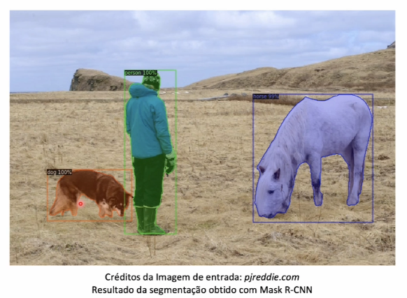
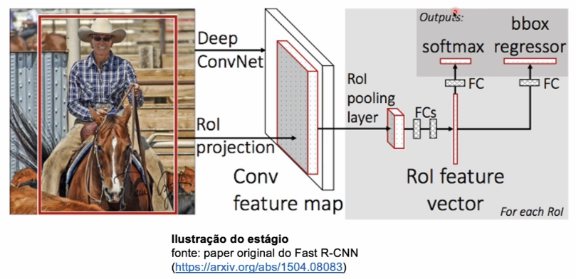

# Segmentação de Instâncias

Este tipo de segmentação trata objetos da mesma categoria como entidades distintas. Por exemplo, se houvesse numa imagem 2 cachorros, ambos estariam com cores diferentes, pois cada cachorro seria tratado como uma entidade diferente.

As principais arquiteturas utilizadas para trabalhar com esse tipo de segmentação é o **Mask R-CNN** e **YOLACT**.

Iremos trabalhar com a **Mask R-CNN**, uma arquitetura criada pelo Facebook AI Research (FAIR), atualmente é uma das abordagens mais utilizadas para segmentação de imagens.

Sua arquitetura permite unir a **Segmentação** com **Detecção de objetos**.

Na imagem acima, é possível **detectar** um cachorro, de uma pessoa e um cavalo com caixas chamadas *bounding boxes* (ou caixas delimitadoras), assim como, também é aplicada a **segmentação** para selecionar somente as partes que fazem parte do objeto específico.

### **O que é Mask R-CNN (Regional Convolutional Neural Network)**

É uma arquitetura baseada numa rede neural convolucional. É basicamente uma extensão da popular arquitetura de detecção de objetos *Faster R-CNN*.

Basicamente, nas camadas de saída dessa rede neural é retornado a classe do objeto (por exemplo, se é um gato, um cachorro ou uma pessoa) e também as coordenadas do *bounding box* (caixa).

**O framework possui dois estágios:**
- Escaneia a imagem e gera *proposals* (áreas prováveis de conter um objeto)
    - O objetivo é retornar apenas uma caixa delimitadora, porém essa rede neural vai gerar várias outras caixas que possívelmente podem estar relacionado com o objeto (por exemplo, a imagem de uma pessoa).
    - É escolhido aquela que mais se adequa a imagem.
- Classifica os *proposals* e gera as suas caixas delimitadores de máscaras.
    - As máscaras são geradas de acordo com a posição das caixas.

A CNN (Rede neural convolucional) recebe cada uma das caixas de *proposals* (quadradinhos) que são as possíveis regiões onde um objeto pode estar contido. Na sequência fará a classificação para saber se de fato trata-se ou não de um determinado objeto.

A camada de saída dessa arquitetura contem uma função de ativação *softmax*, responsável por **retornar as probabilidades de ser uma classe ou outra** e uma função chamada *bbox regressor*, responsável pela previsão de números, onde a ideia seria **prever as coordenadas das caixas delimitadoras**.

Características de baixo nível:
- Bordas, cantos e contornos.

Características de alto nível:
- Estão relacionados ao objeto em si.

